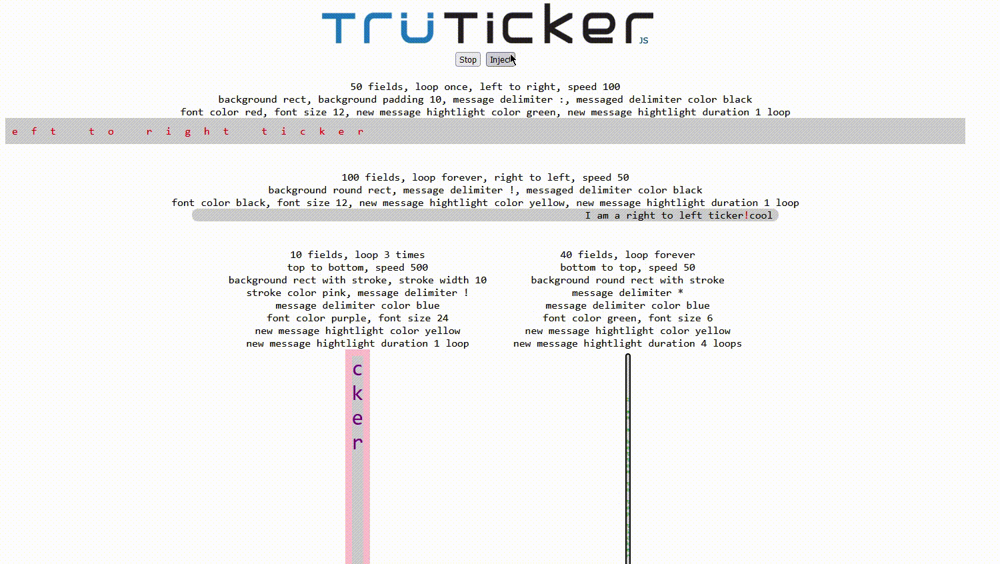

<p align="center">
        
</p>

Ehanched Marquee Library
==============

A spiritual successor and javascript port of an actionscript 3 library I authored in 2009.

# What does it do ?

TrüTicker is nothing more than a re-engineered marquee tag with a lot more options to control behavior.

# What to include

## Just include either the minified or non-minified module in your html page. 

```html
<script type="module" src="tru-ticker.min.mjs" async></script>
```

# API

```javascript
        start() //starts the ticker
        stop() //stops the ticker
        add(messages); //injects additional messages into the existing message array
```

# How to configure

## The following configurations are supported

- container: this is the dom element that will hold the ticker
- messages: an initial list of messages
- onInitialize: a callback function when the ticker is ready to start tickn'
- autoStart: if true, onInitialize is ignored, and the ticker is started
- fields: number character containers
- direction: LEFT_TO_RIGHT,TOP_TO_BOTTOM,RIGHT_TO_LEFT,BOTTOM_TO_TOP
- speed: update delay in milliseconds (lower number is faster)
- behavior: INFINITE,ONCE,LOOP_N
- loop: if LOOP_N is specificed, the number of times to loop before stopping
- fontFamily: the font face
- fontSize: size of font
- fontColor: color of message character except for newly added items
- messageDelimiter: user specified character to visually split messages
- messageDelimiterColor: color of the above delimiter
- highLightColor: when a new message is adde, the characters will be assigned a different color
- highLightDuration: the number of loops for the highlight characters to remain highlighted
- backgroundType: RECT,ROUND_RECT,RECT_STROKE,ROUND_RECT_STROKE
- backgroundColor: color of the background
- backgroundPadding: padding of container
- backgroundRadius: rounded corner radius
- backgroundStrokeWidth: stroke width
- backgroundStrokeColor: stroke color

### Example

```javascript
import {
    TruTicker,
    TruTickerConfig
} from './tru-ticker.min.mjs';

let leftToRightTicker = new TruTicker(TruTickerConfig.builder
    .container(document.getElementById("ticker1"))
    .fields(50)
    .behavior(TruTickerConfig.ONCE)
    .direction(TruTickerConfig.LEFT_TO_RIGHT)
    .speed(100)
    .backgroundType(TruTickerConfig.RECT)
    .backgroundPadding(10)
    .messageDelimiter(':')
    .messageDelimiterColor('black')
    .fontColor('red')
    .fontSize('12pt')
    .highLightColor('green')
    .highLightDuration(1)
    .autoStart(true)
    .messages(['I am a left to right ticker'])
    .build());

```

# Demonstration


